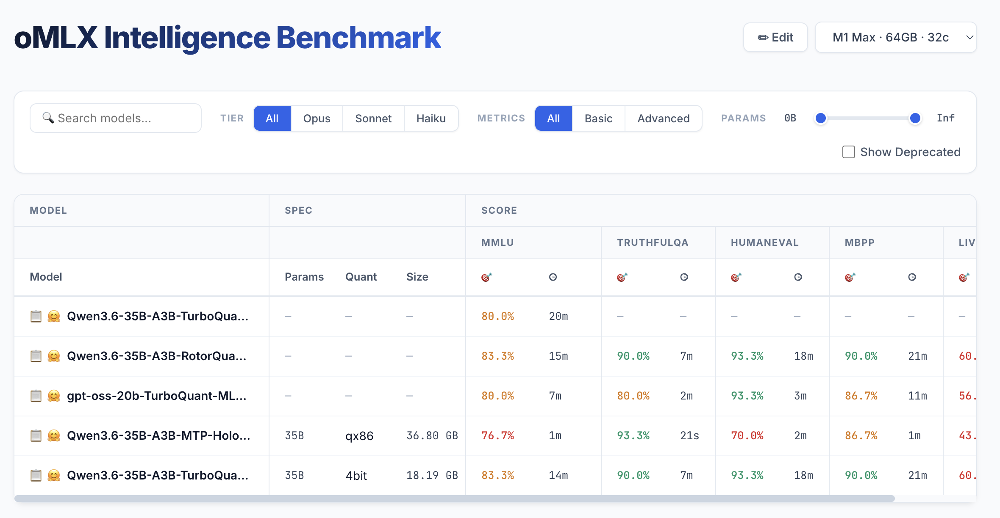

# oMLX Intelligence Benchmark

The aim of this repository is to build a collection list for the most suitable local AI models running on Mac devices, with the intention of freeing up more time for humans.

Cloud AI models are strong nowadays. But local AI models are still needed.

View the website: `https://TonyPythoneer.github.io/omlx-intelligence-benchmark/`

## Contributing

There are two ways to contribute benchmark data:

**1. Open an Issue (recommended)**

Use the [Auto Data Import](.github/ISSUE_TEMPLATE/auto-data-import.yml) issue template: pick a device, paste your benchmark runner stdout, submit.

- **If you're the repo owner**, the workflow runs automatically — a PR is opened, validated by `vp test`, and auto-merged.
- **If you're a contributor**, the workflow won't auto-trigger. The owner will review and add the `approved-import` label to run the import.

**2. Open a Pull Request directly**

Fork the repo, edit `app/data/<device>.json` by hand (or run the app locally with `make serve` and use the in-browser `+ Import`), then open a PR against `main`. The same `vp test` validation runs on every PR touching `app/data/**` or `app/lib/**` before merge.

## Why do I need to make this repository?

The process of intelligence benchmarking is time-consuming and requires a lot of effort.

If there is a open data in the network. People can directly use it instead of evaluating the models themselves.
